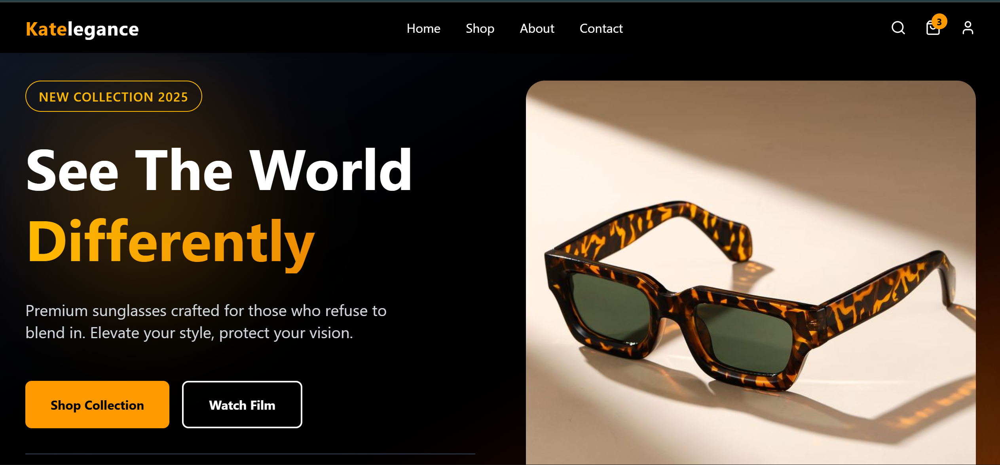
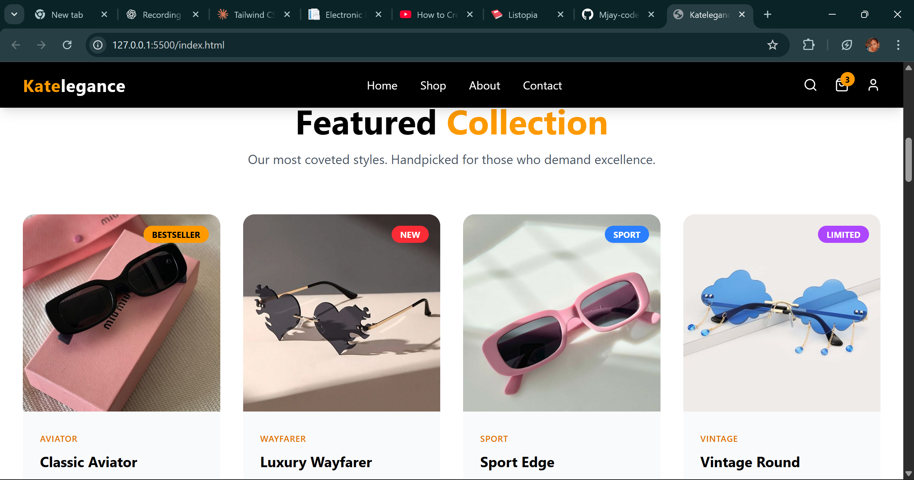

# Katelegance - Premium Sunglasses E-Commerce

A modern, responsive e-commerce website for luxury sunglasses, built with HTML and Tailwind CSS as my first web development project.



## 🌟 Features

- **Responsive Design**: Seamlessly adapts from mobile to desktop using mobile-first approach
- **Modern UI/UX**: Clean, elegant interface with smooth animations and hover effects
- **Product Showcase**: Featured collection and comprehensive product grid with 12+ items
- **Customer Testimonials**: Social proof section with real customer reviews
- **Interactive Elements**: Hover effects, scale animations, and smooth transitions throughout
- **Anchor Navigation**: Smooth scrolling between sections
- **WhatsApp Integration**: Direct contact option for modern e-commerce experience

## 🛠️ Technologies Used

- **HTML5** - Semantic markup
- **Tailwind CSS v4** - Utility-first CSS framework
- **Lucide Icons** - Modern icon library
- **Tailwind Standalone CLI** - No Node.js dependencies required
- **Vanilla JavaScript** (coming soon for interactivity)

## 📂 Project Structure
```
katelegance/
├── src/
│   └── input.css          # Tailwind source file (@import directives)
├── dist/
│   └── output.css         # Compiled Tailwind CSS (auto-generated)
├── images/                # Product images and customer avatars
│   ├── product-*.jpeg     # Product showcase images
│   ├── grid-product-*.jpeg # Product grid images
│   └── *-avatar-head.jpeg # Customer testimonial images
├── screenshots/           # README preview images
│   ├── hero.png
│   ├── products.png
│   └── preview.png
├── index.html             # Main HTML file
├── tailwindcss.exe        # Tailwind standalone CLI (Windows)
├── favicon.png            # Site favicon (will be put later)
└── README.md              # This file
```

## 🚀 Getting Started

### Prerequisites
- A modern web browser (Chrome, Firefox, Safari, Edge)
- (Optional) VS Code with Live Server extension for development

### Installation & Setup

1. **Clone the repository:**
```bash
git clone https://github.com/mjay-code-oss/katelegance-ecommerce.git
cd katelegance-ecommerce
```

2. **View the project:**
   - **Option A:** Open `index.html` directly in your browser
   - **Option B:** Use Live Server in VS Code for hot-reload during development

3. **To rebuild CSS** (if you make changes to HTML classes):
```bash
.\tailwindcss.exe -i ./src/input.css -o ./dist/output.css --watch
```

Press `Ctrl+C` to stop the watch process when done.

## 📸 Screenshots

### Hero Section

*Full-screen hero with gradient background, smooth animations, and call-to-action buttons*

### Featured Collection

*Handpicked products with hover effects, ratings, and category badges*

### Product Grid
*Comprehensive collection with filtering options and quick view overlays*

### Customer Testimonials
*Social proof with real reviews and customer avatars*

## 🎯 Learning Outcomes

Building this project taught me:

- **Mobile-First Responsive Design** - Starting with mobile layouts and scaling up
- **Tailwind CSS Mastery** - Understanding utility classes, responsive breakpoints, and the Tailwind philosophy
- **Modern E-Commerce UI Patterns** - Product cards, hover states, badges, testimonials, and CTAs
- **CSS Grid & Flexbox** - Layout systems for complex responsive designs
- **Smooth Animations** - Using Tailwind's transition and transform utilities
- **Semantic HTML** - Proper document structure and accessibility considerations
- **Git & GitHub Workflow** - Version control and documentation practices

## 🔮 Future Enhancements

- [ ] **JavaScript Interactivity**
  - Hamburger menu toggle for mobile
  - Product filtering by category
  - Shopping cart functionality
  - Image gallery/lightbox for product quick view
  
- [ ] **Additional Features**
  - Product detail pages
  - Search functionality
  - User authentication
  - Wishlist/favorites system
  
- [ ] **Backend Integration**
  - Payment gateway (Stripe/PayPal)
  - Database for products and orders
  - Admin dashboard
  
- [ ] **Performance Optimization**
  - Image lazy loading
  - CSS minification for production
  - SEO optimization

## 💡 Why This Project?

I chose to build an e-commerce site because:
1. It combines multiple UI patterns (grids, cards, navigation, forms)
2. Responsive design is crucial for online shopping
3. It's portfolio-worthy and demonstrates real-world skills
4. E-commerce is a growing industry with high demand for developers

## 🌍 Live Demo

*Coming soon - Will be deployed via GitHub Pages*

## 👩‍💻 Author

**Maryjane Ibemere**

- GitHub: [@mjay-code-oss](https://github.com/mjay-code-oss)
- Twitter/X: [@Mae_ree_jayne](https://twitter.com/Mae_ree_jayne)
- Location: Lagos State, Nigeria

*Currently learning web development and building my portfolio. Open to opportunities and collaborations!*

## 🤝 Contributing

This is a personal learning project, but feedback and suggestions are always welcome! Feel free to:
- Open an issue for bugs or suggestions
- Fork the repo and experiment
- Share your own improvements

## 📄 License

This project is open source and available under the [MIT License](LICENSE).

## 🙏 Acknowledgments

- Inspired by modern e-commerce sites like ASOS, Zara, and luxury eyewear brands
- Built while learning from various web development resources
- Tailwind CSS for making styling enjoyable and fast
- The developer community for endless inspiration

---

⭐ **Star this repo if you found it helpful or inspiring!**

💬 **Questions? Reach out on Twitter [@Mae_ree_jayne](https://twitter.com/Mae_ree_jayne)**

---

*Built with love and determination in Lagos, Nigeria 🇳🇬*